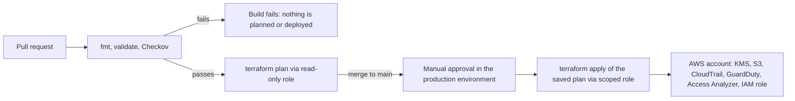

# Secure AWS Baseline with Terraform and CI/CD

A small, security-first AWS environment defined entirely in Terraform and deployed by a GitHub Actions pipeline. It turns on audit logging, threat detection and external-access analysis, adds one least-privilege role, and makes the pipeline itself a security control: no stored AWS keys, security scanning that fails the build, and a manual approval before anything changes in AWS.

> **Scope:** a single-account, single-region baseline built to demonstrate DevSecOps practice. It is not a full landing zone.

## What gets deployed

| Resource | Purpose |
| --- | --- |
| KMS key (rotation on) | Encrypts CloudTrail logs; key policy lets only CloudTrail encrypt, constrained to this trail |
| S3 log bucket | Private, versioned, KMS-encrypted, TLS-only, logs expire after a set retention |
| CloudTrail trail | All regions, global service events, log file validation (tamper evidence) |
| GuardDuty detector | Managed threat detection, findings every 15 minutes |
| IAM Access Analyzer | Flags resources shared outside the account |
| `baseline-log-reader` role | Read-only access to the logs and key, MFA required |
| Optional: account-wide S3 Block Public Access | Off by default; enable in a dedicated lab account |

## How it fits together

## Repository layout

| Path | What it is |
| --- | --- |
| `bootstrap/` | Run once from a laptop. Creates the remote state bucket, the GitHub OIDC provider and the two pipeline roles. |
| `infra/` | The baseline itself. Only the pipeline deploys this. |
| `.github/workflows/terraform.yml` | Validate and scan, plan, approve, apply. |
| `.github/workflows/destroy.yml` | Manual, approval-gated teardown. |

## Security decisions

| Decision | Why |
| --- | --- |
| **OIDC instead of access keys** | Jobs get short-lived credentials. There is no long-lived secret to leak or rotate. |
| **Two roles, split by risk** | Plan uses a read-only role and can run on pull requests. Apply uses a separate scoped role that only a job in the `production` environment can assume. |
| **Apply role cannot edit itself** | It may only manage IAM roles named `baseline-*`; the pipeline roles are named `gha-tf-*`, so there is no path to escalate its own privileges. |
| **Apply the reviewed plan** | The plan saved from the main-branch run is what gets applied, so what was reviewed is what runs. |
| **Scan before plan** | Checkov runs first. A failing scan stops the pipeline before AWS is touched. |
| **State is private and locked** | Versioned, encrypted, TLS-only S3 bucket with native S3 locking (no DynamoDB table needed). |
| **Provider versions pinned** | The lock file is committed and checked in CI so plan and apply use identical providers. |
| **MFA on the log-reader role** | The role can be assumed only by principals that signed in with MFA. |

## Accepted risks and documented exceptions

Checkov reports no unexcepted findings. Each exception sits next to the resource in the code with its reason. They are listed here so the trade-offs are visible, not hidden.

| Exception | Where | Reason | Next step |
| --- | --- | --- | --- |
| IAM write and `*` resource checks | Apply role policy | Create-type actions for CloudTrail, GuardDuty, Access Analyzer and KMS have no ARN to name beforehand | Add a permissions boundary; tighten using Access Analyzer policy generation |
| IAM permission-management check | Apply role policy | Scoped to `baseline-*` roles, which Checkov cannot evaluate | Permissions boundary on created roles |
| KMS key policy checks | CloudTrail key | A key policy must let the account root delegate to IAM, and `*` there means the key itself | None; this is the standard pattern |
| S3 access logging, replication, event notifications | Log and state buckets | Would need extra buckets or regions for a single-account lab | Ship logs to a separate logging account |
| CloudTrail to CloudWatch Logs, SNS | Trail | Alerting is the next milestone | Metric filters and alarms for root use and policy changes |
| GuardDuty organisation and multi-region | Detector | Needs AWS Organizations | Enable in every region via Organizations |

Known gaps: the read-only plan role uses the AWS-managed `ReadOnlyAccess` policy, which can read objects in any bucket in the account. That is acceptable in a dedicated lab account, but a production setup should use a narrower policy.

## Deploy it yourself

You need an AWS account (preferably a dedicated one), a GitHub repository, Terraform 1.11 or later, and the AWS CLI.

1. **Bootstrap once**: `cd bootstrap`, copy `terraform.tfvars.example` to `terraform.tfvars`, set `github_repo`, then `terraform init && terraform apply`.
2. **Configure GitHub**: add the four outputs as repository variables (`TF_STATE_BUCKET`, `AWS_PLAN_ROLE_ARN`, `AWS_APPLY_ROLE_ARN`, `AWS_REGION`) and create an environment named `production` with required reviewers.
3. **Commit the lock file**: `cd infra && terraform init -backend=false && terraform providers lock -platform=linux_amd64 -platform=windows_amd64 -platform=darwin_arm64`, then commit `.terraform.lock.hcl`.
4. **Open a pull request.** Checks and plan run. Merge, approve the deployment, and the baseline is applied.

## Cost

A few cents a day for S3, plus a small monthly charge for the KMS key, with GuardDuty free during its trial period and then billed by usage. Prices change, so set a budget alert and check Cost Explorer. Use the `terraform-destroy` workflow when you are done.

## Teardown

Run the **terraform-destroy** workflow from the Actions tab, type `destroy`, and approve. To remove the bootstrap resources as well, run `terraform destroy` in `bootstrap/` afterwards.

## Stretch goals

- CloudTrail to CloudWatch Logs with metric filters and alarms (root usage, IAM policy changes, console sign-in without MFA)
- GuardDuty findings to EventBridge and SNS
- A private VPC and a workload module
- Permissions boundary for the apply role
- Secret scanning in CI
- Multi-environment layout (dev and prod)
